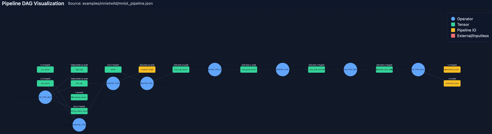

# Example: MNIST Recognition

This sample demonstrates how to take a high-resolution street photo that contains a handwritten digit, prepare it for MNIST inference with SecureMR, and extend the preprocessing graph with secure model execution operators.

## What the sample does
- Loads `number_5.png`, a 3248×2464 RGB image captured “in the wild”.
- Builds an affine transform to crop the digit (224×224 region of interest) and ensures the image matches the expected capture resolution.
- Converts the crop to grayscale, casts to `float32`, and normalizes pixel values to the `[0, 1]` range.
- Serializes the preprocessing graph as a SecureMR `Pipeline`, saves it to `mnist_pipeline.json`, and verifies the pipeline by comparing tensor outputs with an imperative implementation.
- Restores the serialized pipeline, runs a QNN MNIST classifier (`mnist.serialized.bin`), and appends both a Virtual Sensor Twin (VST) operator and the model inference operator back into the pipeline so the full flow can be exported.

## Processing pipeline
1. `GET_AFFINE` computes the warp matrix from the source crop points.
2. `APPLY_AFFINE` warps the source `image` placeholder into a dedicated RGB crop tensor.
3. `CONVERT_COLOR` transforms the crop to grayscale.
4. `ASSIGNMENT` casts the grayscale tensor to `float32`.
5. `ARITHMETIC_COMPOSE("{0} / 255.0")` scales pixels to `[0, 1]`.
6. `ASSIGNMENT` copies the RGB crop to a placeholder so it can be exported alongside the normalized tensor.
7. `add_vst_operator` and `add_model_inference_operator` extend the graph so downstream SecureMR runtimes can execute the pre- and post-processing together.

## Running the example
```bash
cd pySecureMR/examples/mnistwild
python mnistwild.py
```

Successful execution prints the predicted class and confidence for `number_5.png`, and emits an updated `mnist_pipeline.json` that contains the VST and model inference nodes.

## Pipeline visualization
The rendered graph below mirrors the operators described above.



## Key files
- `mnistwild.py`: Imperative preprocessing, pipeline construction, and inference script.
- `mnist_pipeline.json`: Serialized SecureMR pipeline with VST and MNIST inference operators.
- `mnist.serialized.bin`: MNIST classification model in QNN context binary format.
- `number_5.png`: Sample capture used to drive the example (see also `number_2.png` for experimentation).
